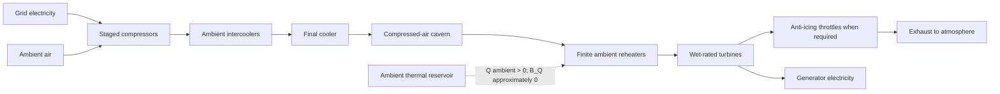
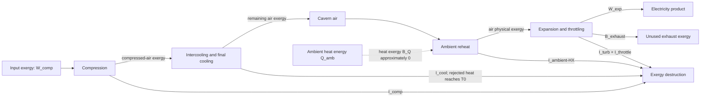
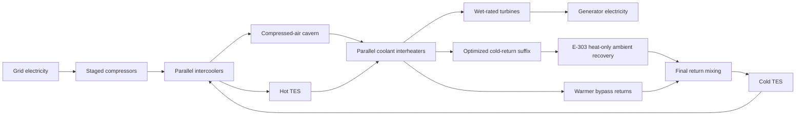
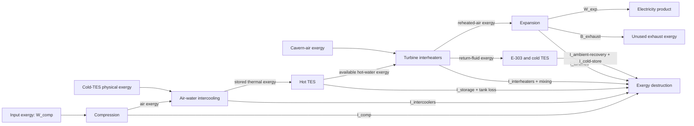
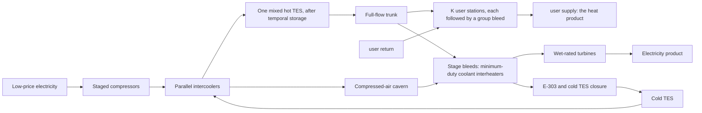
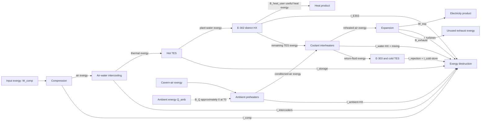

# CAES plant concepts and architectures

> **Parent:** [Documentation map](00_DOCUMENTATION_MAP.md)  
> **Children:** [Physics boundary](02_PHYSICS_AND_MODEL_BOUNDARY.md) · [Theory and objectives](11_THEORY_AND_DESIGN_OBJECTIVES.md)  
> **Related:** [Configuration logic](05_CONFIGURATION_LOGIC.md)

This is the plant-level reference for the three architectures implemented in
this repository:

1. **AD-CAES (ambient diabatic)**;
2. **LTA-CAES (low-temperature adiabatic CAES)**;
3. **LTHP-CAES (low-temperature heat and power CAES)**.

The program is a configuration-brainstorming and thermodynamic-screening tool.
Every run is one independently sized candidate plant, not another operating
point of a single fixed plant. Its comparisons are meant to select concepts,
expose coupled parameters and delimit feasible regions before component
geometry, cost, controls and off-design operation are introduced.

LTHP-CAES always has an external HEAT USER, and that user is deliberately
generic. It is specified by the temperature it wants, the temperature it
returns, and the exchanger NTU class, which describe a
district-heating network, an industrial process loop, an absorption chiller, a
greenhouse or a dryer equally well. District heating is the most likely
application, not the model's subject, and nothing in the solver assumes it.
The name says so: low-temperature HEAT AND POWER CAES.

LTHP-CAES always has an off-take. Direct process-air ambient reheat belongs to
AD-CAES alone: the adiabatic concepts take every joule of turbine reheat from
the coolant loop, while heat-only E-303 may warm selected cold coolant returns.
The AH-20x ambient preheaters LTHP used to carry were removed
because they were up to eight extra high-pressure gas/ambient exchangers with
their fans and controls, and because they were modelled with zero air-side
pressure drop while every other exchanger in the train paid one - which
flattered LTHP against AD-CAES, where the same device does pay it.

The analysis basis is one kilogram of dry process air. Mass-flow and plant-power
results are obtained by multiplying specific quantities by dry-air mass flow.

## Read this distinction first

Heat and exergy are not interchangeable.

- Heat taken from an ambient reservoir at the selected dead-state temperature
  is a positive **energy** input.
- Its heat-transfer exergy is approximately zero:

```text
B_Q = Q (1 - T0 / T_boundary) ~= 0 when T_boundary = T0
```

- Work is pure exergy.
- District heat above ambient contains less exergy than energy.

Consequently, the electricity-based delivery ratio

```text
R_delivery = (W_exp + Q_DH) / W_comp
```

is the repository's single energy metric, and the repository also reports:

```text
eta_exergy = (W_exp + B_DH) / W_comp
```

`R_delivery` prices only the electricity the plant buys. Every ambient stream it
harvests is free and therefore stays out of the denominator: the AD-CAES
ambient reheat duty (structurally zero in the adiabatic concepts) and the energy
the air itself hands over when the exhaust leaves below intake enthalpy, a
heat-pump-like effect worth up to about 49 kJ/kg-air in the supplied
configurations. So `R_delivery` **may exceed 100%**, exactly as a
COP does, and it is not a first-law or second-law efficiency. The closed
boundary balance lives in the energy Sankey, not in this ratio.

`eta_exergy` must remain below one for the modeled cycle, and does. It is the
complete thermodynamic accounting.

See
[Objectives, metrics, and exergy accounting](03_OBJECTIVES_METRICS_AND_EXERGY_ACCOUNTING.md#the-one-energy-metric-and-what-it-deliberately-excludes).

## Common thermodynamic boundary

All three plants include:

- ambient inlet air;
- staged real-gas compression;
- a surface final cooler and ideal liquid separator;
- a constant-pressure cavern state in the normalized cycle;
- staged real-gas expansion;
- wet-rated expander screening and an exhaust stream;
- compressor input work and expander output work.

Motor, generator, gearbox, fan and pump efficiencies are not yet deducted.
Cavern pressure transients, wall heat transfer, geomechanics and piping network
dynamics are also outside the present steady normalized boundary.

CoolProp supplies real-air enthalpy and entropy. Compression and expansion use:

```text
h_comp,out = h_in + (h_is,out - h_in) / eta_comp

h_exp,out = h_in - eta_exp (h_in - h_is,out)

w = h_out - h_in
```

The sign convention is positive work into the air. Compression work is
positive and expansion work is negative; `PlantResult` exposes expansion output
as a positive product.

### Component-tag legend

| Tag | Component |
|---|---|
| F-101 | inlet filter and silencer |
| K-10x | compressor bodies |
| E-10x | charging intercoolers; the last one is the final cooler |
| AC-101 | final charge aftercooler, i.e. the cavern equilibration state |
| M-101 / W-101 | compressor motor / grid import tie |
| V-401 | compressed-air cavern |
| XV-401 / XV-402 | charge and discharge wellhead block valves |
| AH-20x | ambient reheaters (AD-CAES only; its sole discharge heat source) |
| TK-301 | one mixed hot coolant store |
| E-302 / E-302A.. | heat-user exchangers; exactly one before each group bleed |
| H-301 | the external heat user, whatever it is |
| E-20x | coolant interheaters (adiabatic concepts only) |
| T-20x | expander bodies |
| TV-20x | isenthalpic throttle valves (AD-CAES) |
| MS-20x | moisture separators/demisters |
| G-201 / W-201 | generator / grid export tie |
| S-201 | exhaust stack to atmosphere |
| TK-301 / TK-302 | hot and cold TES tanks |
| P-301 / P-302 | hot- and cold-side coolant-loop pumps |
| E-302 / H-301 | the user cascade / the external heat user |
| E-303 | one heat-only ambient recovery exchanger on the optimized return suffix |

Two tags are reporting-only and are deliberately absent from the generated
P&ID, which shows thermodynamic process equipment exclusively:

- `MS-20x`, the expander-outlet separators/demisters, which belong to the
  drying architecture of
  [document 06](06_MOISTURE_DEW_POINT_AND_WET_EXPANSION.md) together with the
  omitted dryers;
- `AC-101`, which labels the cavern equilibration state in the moisture
  inventory rather than a separate drawn vessel; on the schematic the last
  `E-10x` carries the caption `Final cooler`.

Every other tag above is drawn.

## 1. AD-CAES (ambient diabatic)

### Physical cycle

During charging, every intercooler rejects compression heat to atmosphere.
There is no thermal store. During discharge, a finite ambient-air exchanger
warms process air that is colder than ambient. The turbine takes the maximum
pressure drop compatible with the wet-expander anti-icing envelope. If the
complete scheduled pressure ratio is unsafe, an isenthalpic valve completes
the remaining pressure reduction. No fuel or combustion is used.



### Left-to-right exergy flow



The ambient arrow is deliberately dotted: ambient heat changes the energy
balance but does not provide positive exergy at the chosen dead state. Heating
a below-ambient stream can actually destroy part of its cold physical exergy.

### Main performance limitations

- all compression heat is rejected;
- finite ambient-HX NTU prevents exact return to ambient temperature;
- pressure losses reduce both stored-air exergy and expansion work;
- throttling preserves anti-icing safety but produces no shaft work;
- moisture and frost limits can prevent the full turbine pressure ratio;
- exhaust air may leave with unused physical exergy.

## 2. LTA-CAES (low-temperature adiabatic CAES)

### Physical cycle

Cold TES fluid is divided among parallel intercooler branches. Their real
outlets mix in the hot tank. After storage dwell, all hot-tank fluid is divided
among turbine interheaters. There is no `E-302` in this architecture.

The interheater allocation maximizes real multi-stage turbine work while:

- conserving total charge/discharge coolant throughput;
- respecting finite HX conductance;
- respecting the turbine inlet material limit;
- keeping every expander on its wet/frost operating envelope;
- respecting direct coolant minimum and maximum temperature limits.

After the interheaters, the solver selects one ordered suffix of return branches,
mixes that subgroup, warms it toward ambient through `E-303`, and finally mixes
it with warmer bypass returns before the cold tank. E-303 never cools a return.
If a plant needs an unmodelled heat-rejection sink to close periodically, the
configuration is infeasible; no coolant-limit, wet-expander, or icing
constraint is relaxed.



### Left-to-right exergy flow



### TES temperatures and mixing

Each branch has its own coolant flow and outlet temperature. Headers and tanks
are modeled as ideal adiabatic mixers:

```text
r_total = sum(r_i)

T_mix = sum(r_i T_i) / r_total

T_hot = T_cold + sum(Q_intercooler,i) / (r_total cp_coolant)
```

The temperature formula is exactly the enthalpy balance while constant coolant
`cp` is used. Mixing exergy destruction is calculated separately:

```text
I_mix = sum[r_i b(T_i)] - r_total b(T_mix)
```

This is a conservative lumped two-tank approximation. It does not represent a
thermocline, multiple temperature levels, or temperature-selective manifolds.

### Direct coolant temperature limits

The user supplies direct minimum and maximum coolant temperatures:

```text
T_coolant,min <= T_coolant <= T_coolant,max
```

Every branch outlet and mixed tank state is checked directly. The broad
brainstorming defaults are -80 degC and 200 degC. The solver retains a constant reference-coolant heat capacity (4180
J/kg/K), but does not infer coolant properties or limits from pressure.

### Coolant freezing limit

The reference coolant defaults to:

```text
T_coolant,min = -80 degC; T_coolant,max = 200 degC
```

Every cold-TES state and interheater return must remain within the selected
limits. `coolant_freezing_temperature_c` remains a load-only legacy alias for
`coolant_minimum_temperature_c`.

That input does **not** make the present constant-property coolant model a
validated glycol model. A real blend changes:

- specific heat;
- density and tank volume;
- viscosity, pump work and pressure loss;
- thermal conductivity and HX area;
- freezing and burst protection;
- boiling curve, corrosion and material compatibility.

Vendor property tables must replace the reference constants before detailed design.

## 3. LTHP-CAES (low-temperature heat and power CAES)

### Why the component order matters

The mixed hot store feeds one trunk. All coolant crosses user exchanger 0;
interheater group 0 then bleeds its required flow, and only the remainder
crosses exchanger 1. Exactly K exchangers and K non-empty group bleeds repeat
this pattern. The final exchanger is followed by the final bleed, so no K+1
body exists after the trunk is empty.

The flow through the user exchangers is therefore a decreasing staircase.
With a common plant-side temperature drop, exchanger 0 transfers the most heat
and every later duty is smaller. K=1 is the classic single series exchanger
ahead of all interheaters.

The user side runs **counter to the trunk in series**: its return enters the
coldest station and its supply leaves the hottest, so the cold stations preheat
and only the top one makes the final lift. Connecting the stations in parallel
instead would demand the final supply temperature at every branch and an
effectiveness unavailable at the configured NTU, which the cold end of the
cascade cannot offer.

On the air side, each expansion stage uses:

```text
previous turbine outlet -> coolant interheater E-20x -> turbine T-20x
```

There is no ambient exchanger in this train. The low-grade duty that AH-20x
used to supply is a genuine demand - the tail stages need much less reheat than
the first, so a single hot-tank temperature is a poor match for them - but it
is a demand the WATER side should answer, not the atmosphere. The measured
mismatch is in the baseline table below.



This plant shifts two products through time:

- compressed-air exergy later becomes electricity;
- compression heat later becomes district heat and turbine reheat.

Ambient assistance reduces the low-temperature part of the TES duty and frees
more stored heat for `E-302`.

### Left-to-right exergy flow



The combined useful exergy product is:

```text
B_product = W_exp + B_DH
```

Ambient energy is shown in the diagram because it matters to the first-law
balance, but it is not an additional positive exergy source at `T0`.

### Heat-user exchanger constraints

The user can receive the complete `E-302` duty only if every counter-current
station fits its configured NTU class:

```text
epsilon_required = Q / [Cmin (T_hot,in - T_user,in)]
epsilon_required <= epsilon_counterflow(NTU_user, Cmin/Cmax)
```

The user flow follows from total duty and its configured supply/return span.
The solver rejects an undersized NTU class instead of silently lowering the
requested user temperature.

### Combined-energy objective

Select:

```text
optimization_objective = max_combined_energy_delivery
```

The outer inventory search then maximizes:

```text
R_delivery = (W_exp + Q_DH) / W_comp
```

instead of making HX profile parallelism the primary ranking criterion.
Profile spread remains reported for equipment sizing.

An LTHP plant at 200 bar with eight stages, `heat_exchanger_ntu = 100`,
an 80/45 degC heat user and a -30 degC antifreeze demonstrates:

- `R_delivery = 103.3%`, above unity;
- total useful exergy efficiency `64.0%`, below unity;
- **zero** ambient heat imported.

That is how apparent greater-than-unity performance should be read, and note
that it needs no ambient exchanger at all. The plant draws the energy out of
the atmosphere through its own working fluid: the exhaust leaves at -27.6 degC,
`42.8 kJ/kg-air` below intake enthalpy, and nobody charges the plant for it.
The delivery ratio counts free harvested energy in its numerator and never in
its denominator, so passing 100% is expected rather than suspect. Only the
second line is a bound - `eta_exergy` is always below one. See
[the expenditure-ratio note](03_OBJECTIVES_METRICS_AND_EXERGY_ACCOUNTING.md#the-one-energy-metric-and-what-it-deliberately-excludes).

## Heat exchanger equations

All water and ambient exchangers use finite effectiveness-NTU models.

```text
C_water = r cp_water
C_min = min(C_air, C_water)
C_max = max(C_air, C_water)
C_r = C_min / C_max
```

For counter-current flow:

```text
epsilon = [1 - exp(-NTU(1-C_r))]
          / [1 - C_r exp(-NTU(1-C_r))]
```

At `C_r = 1`:

```text
epsilon = NTU / (1 + NTU)
```

For an ambient reservoir with effectively infinite capacity rate:

```text
C_r -> 0
epsilon_ambient = 1 - exp(-NTU_ambient)
```

Real-air `cp` is iterated at the mean HX state; final air states are recovered
from real enthalpy.

## Moisture, liquid water, and frost constraints

Charging coolers are followed by ideal liquid separators in the moisture
diagnostic. The remaining humidity ratio is propagated during discharge.

At each pressure:

```text
p_v = p w / (0.621945 + w)

p_sat(T_phase) = p_v
```

The implemented expander is wet-rated for screening purposes:

```text
T_hard = 0 degC       when the phase boundary permits liquid water
         T_frost      when the phase boundary is ice

T_expander,out >= T_hard + 10 K
```

Liquid condensation above freezing is therefore not automatically prohibited.
The model separately screens maximum possible liquid fraction against its
dry-air-model validity limit. OEM limits on droplets, erosion, local wall
temperature and liquid carry-over remain mandatory.

See [Moisture, dew point, and wet expansion](06_MOISTURE_DEW_POINT_AND_WET_EXPANSION.md).

## Tank standing losses and E-303

Each filled tank is presently one lumped thermal capacitance:

```text
C_tank dT/dt = -UA_tank (T - T0)

T_after = T0 + (T_before - T0)
          exp[-UA_tank t / (r_total cp_coolant)]
```

For candidate ordered suffix `s`, its mixed interheater return reaches E-303:

```text
T_E303,out = T0 + (T_suffix - T0) exp(-NTU_E303), T_suffix < T0
```

Only sub-ambient suffix mixtures are legal. The solver evaluates all N suffixes
and selects the largest `R_s cp (T0-T_s)[1-exp(-NTU)]`; this is also the largest
final cold-tank inlet temperature for the fixed return set. The selected outlet
then mixes with the bypass returns. Ambient heat is booked as
`cold_return_heat_absorbed_from_ambient_j_per_kg_air`; rejection is structurally
zero. E-303 fan power and fixed-area/cost limits are not yet included.

## Optimization hierarchy

For each normalized total coolant inventory, the solver:

1. solves the sequential compressor and finite-intercooler train;
2. enforces direct coolant minimum and maximum temperatures;
3. applies hot-tank standing loss;
4. determines moisture-safe turbine requirements;
5. allocates or inversely sizes every water-interheater branch;
6. optimizes the ordered E-303 return suffix, then performs final mixing;
7. derives the next cold-TES temperature from that routed return;
8. evaluates energy, exergy and HX-profile metrics;
9. refines the inventory search around the selected objective, continuing the
   coolant-loop root from the previous inventory rather than rescanning.

The selected objective always ranks feasible designs. LTA-CAES normally
maximizes electrical work. LTHP-CAES normally maximizes useful-energy delivery.
Useful-exergy efficiency and HX-profile spread are reported guard and design
metrics, not alternative hidden ranking criteria. AD-CAES has no coolant-loop
search: its turbine/throttle dispatch is solved directly.

## Scaling to a 70 MW plant

If the compressor shaft input is `P_comp` and the normalized result is
`w_comp`:

```text
m_dot_dry_air = P_comp / w_comp

P_exp = m_dot_dry_air W_exp

Q_dot_user = m_dot_dry_air Q_heat_user

Q_dot_ambient = m_dot_dry_air Q_ambient
```

At this scale the following parasitic loads must be added before claiming a
grid-to-grid result:

- compressor motor and generator losses;
- coolant pumps, including glycol viscosity effects;
- E-303 and ambient-HX fans;
- cooling-tower pumps and seasonal approach;
- cavern wells and control valves;
- district-network pumps.

For the above-unity LTHP example, the normalized result is
`w_comp = 639.63 kJ/kg-air`. A 70 MW compressor shaft input therefore
corresponds to approximately `109.4 kg/s` dry air and, on the present
shaft-only boundary:

```text
expander shaft output       ~= 38.93 MW
heat-user output            ~= 39.14 MW
E-303 ambient heat imported ~=  7.59 MW
electricity + heat delivery ~= 78.07 MW
```

The last line is larger than the 70 MW electrical input only because it mixes
two energy products while charging none of the harvested ambient energy to the
denominator. In addition to E-303, the exhaust carries another `4.69 MW` of
ambient contribution because it leaves `42.81 kJ/kg-air` below intake
enthalpy. The energy Sankey draws both and closes
the boundary balance; `R_delivery` deliberately prices neither, because the
plant pays for neither. Generator, motor, pump and fan losses will reduce the
physical outputs.

## Model-development priorities

For research beyond the present screening model, the recommended order is:

1. replace the perfectly mixed TES by a 10-20 node stratified model;
2. add temperature-selective return manifolds or multiple storage levels;
3. use real glycol/brine properties and pump work;
4. add cavern mass, pressure and wall-temperature dynamics;
5. optimize charge/discharge schedules against electricity and heat prices;
6. include capital cost, HX area, tank pressure class and cavern constraints;
7. validate turbine moisture limits with an OEM map.
