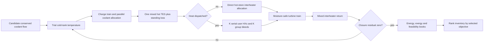
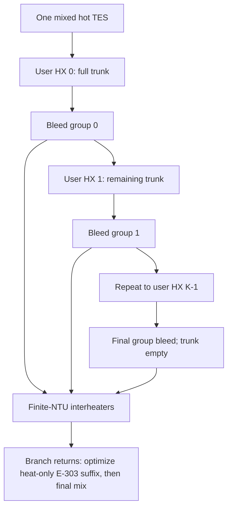

# Coupled optimization workflow

> **Parent:** [Documentation map](00_DOCUMENTATION_MAP.md)  
> **Children:** [Algorithm index](algorithms/README.md) · [Performance registry](09_PERFORMANCE_AND_OPTIMIZATION.md)  
> **Architecture:** [Single-store coolant cascade](12_PROPOSED_COOLANT_CASCADE_ARCHITECTURE.md)

The LTA/LTHP solver compares candidate plants on a one-kilogram-air basis. It
does not time-step one fixed exchanger: constant NTU denotes a performance
class and each candidate implicitly resizes `UA = NTU C_min`.

## Whole-plant map



AD-CAES does not enter this loop. It always uses finite ambient reheat and a
turbine/throttle split that respects the icing envelope.

## Charge block

Air stages are sequential; coolant branches are parallel. For each stage, the
solver obtains the real secant air heat capacity from the solved enthalpy and
temperature change, matches coolant heat-capacity rate, projects all branch
flows onto the candidate inventory, and iterates the split to tolerance.

Every branch starts at the same cold-tank temperature. Its actual return is
checked against the direct coolant maximum. All returns then enthalpy-mix into
one hot stored state; K never changes this block.

## Heat-user discharge block

Stage pressure schedule, expander efficiency and protected humidity fix each
stage's minimum moisture-safe interheater duty before the cascade is solved.
The stages are partitioned into K contiguous, duty-balanced groups.



For every K a safeguarded, continued scalar root chooses the common plant-side
station drop so all inverse-HX bleeds sum to the conserved inventory. The outer
root then reproduces the physical cold-tank state after E-303 routing and dwell.

The user's coolant is one counter-current series stream. Its mass flow is
derived from total duty and configured supply/return temperatures. Every
station must fit the configured counterflow NTU effectiveness.

## Objective dispatch

`max_electric_efficiency` bypasses an installed heat-user cascade and searches
the same electrical endpoint as LTA. `max_combined_energy_delivery` activates
the cascade, gives turbines their moisture-safe duty and exports the feasible
upstream heat. The two reported energy ratios are

```text
eta_electric = W_exp / W_comp
R_delivery = (W_exp + Q_user) / W_comp.
```

`R_delivery` can exceed one because ambient heat is not purchased electricity;
the bounded thermodynamic metric is total useful exergy efficiency.

## Numerical safeguards

- All inverse HXs refine against the same forward finite-NTU law.
- The cold-loop coordinate is the cold-tank temperature because the branch
  distribution, not its untreated mean, determines E-303 placement.
- Previous cold-loop and cascade roots are continuation seeds, but every seed
  is re-evaluated and bracketed.
- Every K closes mass internally before cold-tank closure.
- Charge and discharge coolant totals close within a one-joule energy budget.
- Direct coolant minimum/maximum, moisture, icing and finite-NTU user constraints
  are checked on the materialized train.
- Every component retains its steady-flow first-law residual, and total exergy
  residual must remain below 1 J/kg-air.

Work counts and currently accepted accelerations are canonical in
[Performance and optimization](09_PERFORMANCE_AND_OPTIMIZATION.md); equations
for individual roots are in the [algorithm index](algorithms/README.md).
