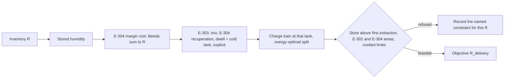
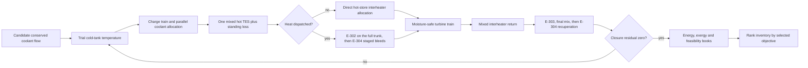
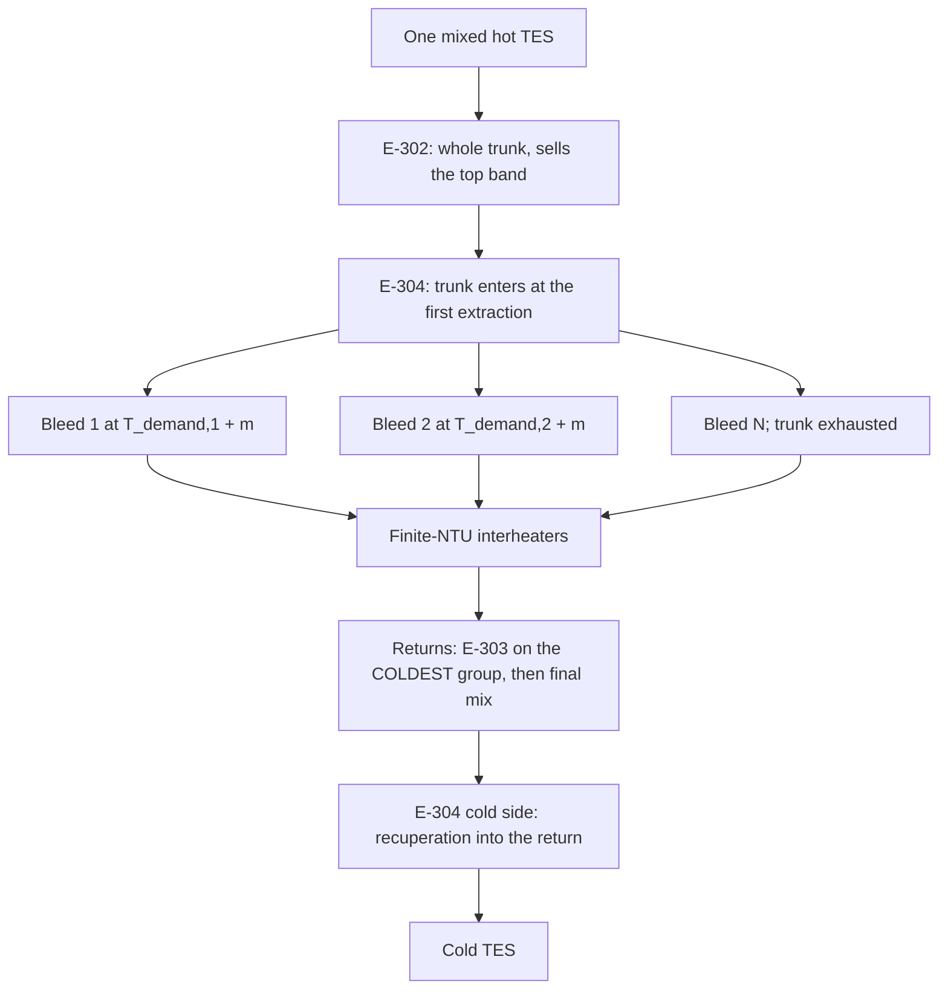

# Coupled optimization workflow

> **Parent:** [Documentation map](00_DOCUMENTATION_MAP.md)  
> **Children:** [Algorithm index](algorithms/README.md) · [Performance registry](09_PERFORMANCE_AND_OPTIMIZATION.md)  
> **Architecture:** [Single-store extraction architecture](12_PROPOSED_COOLANT_CASCADE_ARCHITECTURE.md)  
> **Theory:** [The heat-user plant is one-dimensional](14_HEAT_USER_REDUCTION_AND_CHARGE_SPLIT.md)

The LTA/LTAHP solver compares candidate plants on a one-kilogram-air basis. It
does not time-step one fixed exchanger: constant NTU denotes a performance
class and each candidate implicitly resizes `UA = NTU C_min`.

There are two solvers, because the two dispatches have different structure:

| dispatch | concepts | unknowns per inventory | outer search |
|---|---|---|---|
| minimum-duty, heat sold | LTAHP, `max_combined_energy_delivery` | none: the cold tank is explicit | scan, constraint boundary, Brent |
| absorbing, electricity first | LTA; LTAHP with `max_electric_efficiency` | cold-tank temperature (a root) | coarse walk and refinement |

## Heat-user solver: one variable

Under minimum-duty dispatch the discharge ladder depends on the inventory and
the stored humidity only, so the cold tank follows from it in one evaluation
and the charge train runs once at that tank. Derivation and measurements are
in [document 14](14_HEAT_USER_REDUCTION_AND_CHARGE_SPLIT.md).



The inventory is then searched in one dimension:

1. scan `R` geometrically from a quarter to four times the capacity-rate
   reference, neighbours 25 % apart (the whole 0.1-30 domain, 10 % apart, if
   nothing closes). This scan is also the diagnosis: every refused point
   carries its constraint;
2. bisect every gap between two neighbours refused by different constraints,
   down to 0.2 % of `R`: that is the only place a narrow feasible window can
   hide;
3. move to the best cell under the exergy-optimal charge split;
4. bisect any neighbouring constraint boundary to 0.02 % of `R`;
5. if the objective still rises into that boundary, the boundary is the
   optimum; otherwise run Brent's method on the bracket.

The charge split optimizes two multipliers, on the first and on the last
intercooler branch, around the capacity-matched shape of the rest, for maximum
useful exergy. The reason exergy and not the ranking ratio chooses it is in
[document 14, section 3](14_HEAT_USER_REDUCTION_AND_CHARGE_SPLIT.md#3-one-family-of-objectives-and-why-j-cannot-choose-the-split).

## Electricity-first solver: coupled cold loop



The map above still names E-302 and E-304 because the coupled solver can also
evaluate a heat-user plant (tests and diagnostics call it directly); `run()`
sends every heat-user plant to the one-variable solver instead.

AD-CAES enters neither loop. It always uses finite ambient reheat and a
turbine/throttle split that respects the icing envelope.

## Charge block

Air stages are sequential; coolant branches are parallel. For each stage, the
solver obtains the real secant air heat capacity from the solved enthalpy and
temperature change, matches coolant heat-capacity rate, projects all branch
flows onto the candidate inventory, and iterates the split to tolerance.

Every branch starts at the same cold-tank temperature. Its actual return is
checked against the direct coolant maximum. All returns then enthalpy-mix into
one hot stored state; the discharge network never changes this block.

## Heat-user discharge block

Stage pressure schedule, expander efficiency and protected humidity fix each
stage's minimum moisture-safe duty AND the air temperature its interheater must
produce, before any of the coolant network is solved. That demand profile is
raised to its non-increasing suffix maximum, because a progressively withdrawn
trunk can only get colder along its length.



One safeguarded, continued scalar root chooses the common margin `m` so all
inverse-HX bleeds sum to the conserved inventory; if a stale continuation seed
stops it short, a seed-free bracketed root is used, so feasibility never
depends on which inventory was solved before. Because the first extraction is
the trunk inlet, that same root also fixes what E-302 gets - there is no
separate split to search. E-303, final mixing, E-304 recuperation and dwell
then give the cold tank directly; the coupled solver instead roots it.

The user's coolant is one counter-current stream through one exchanger. Its mass
flow is derived from the duty and the configured supply/return temperatures, and
it must fit the configured counterflow NTU effectiveness. E-304 is held to the
same discipline zone by zone, since its trunk capacity rate steps down at every
extraction.

## Objective dispatch

`max_electric_efficiency` bypasses both E-302 and E-304 and searches the same
electrical endpoint as LTA: without a heat user there is no reason to stage the
trunk, because the only sink for the descent would be the plant's own cold
return. `max_combined_energy_delivery` activates both bodies, gives the turbines
their moisture-safe duty at matched supply temperatures and exports the band
above the first extraction. The two reported energy ratios are

```text
eta_electric = W_exp / W_comp
R_delivery = (W_exp + Q_user) / W_comp.
```

`R_delivery` can exceed one because ambient heat is not purchased electricity;
the bounded thermodynamic metric is total useful exergy efficiency.

## Numerical safeguards

- All inverse HXs refine against the same forward finite-NTU law.
- In the coupled solver the cold-loop coordinate is the cold-tank temperature
  because the branch distribution, not its untreated mean, determines E-303
  placement. The heat-user solver needs no coordinate: its cold tank is
  explicit.
- Previous cold-loop and extraction-margin roots are continuation seeds, but
  every seed is re-evaluated and bracketed.
- The discharge network closes mass internally before cold-tank closure.
- A pinched or undersized E-304 zone rejects the candidate rather than being
  relaxed; less inventory needs a wider margin, which lifts the whole ladder
  away from the return, so the inventory search walks out of a pinched region.
- Charge and discharge coolant totals close within a one-joule energy budget.
- Direct coolant minimum/maximum, moisture, icing and finite-NTU user constraints
  are checked on the materialized train.
- Every component retains its steady-flow first-law residual, and total exergy
  residual must remain below 1 J/kg-air.

Work counts and currently accepted accelerations are canonical in
[Performance and optimization](09_PERFORMANCE_AND_OPTIMIZATION.md); equations
for individual roots are in the [algorithm index](algorithms/README.md).
